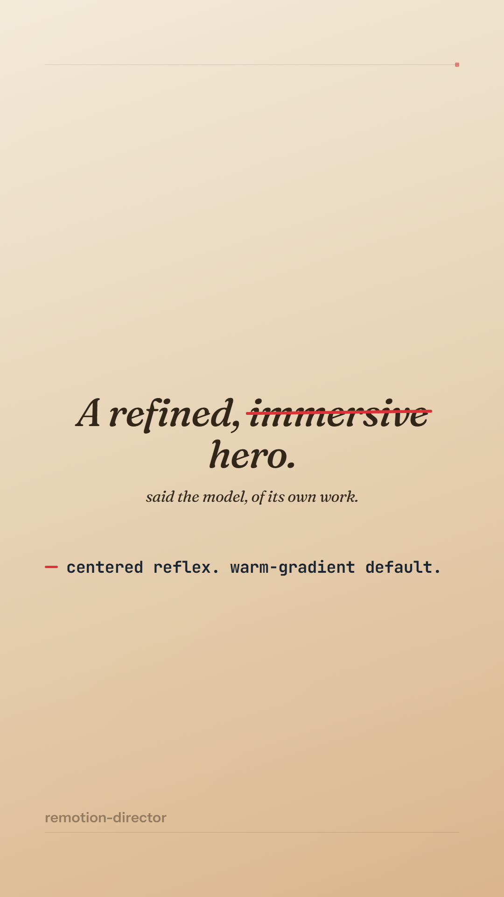

# remotion-director

<div align="center">

<a href="docs/assets/hero.mp4"></a>

<sub>▶ **[Play the 20s promo](docs/assets/hero.mp4)** (1080×1920) — *the pipeline's own promo, designed and built by the model in **near one-shot**.* The only human input was the goal "make a promo for this" and one nudge on text pacing — no design doc, no reference, no art direction. What you're watching is the model naming its own defaults (*centered reflex, warm-gradient default*) and striking them out.</sub>

</div>

There's a settled assumption about AI and design, and it comes in two flavors. One: **AI only gets to write the code** — good design still has to be squeezed out of it by a human, round after round of prompting, the human's taste doing all the real work. Two, the more generous-sounding version: AI *can* design — so long as you feed it the taste, a `design.md`, a template, a reference, treating "hand the model your design system" as the mature practice.

Both quietly agree that the design doesn't come from the AI. This project doesn't.

For a model that has read essentially the entire internet, **the good design is already in there.** Every principle, every reference, every act of taste a human art director ever published — it has seen them. It defaults to slop not because it lacks the design, but because nothing in the request *excites that part of the weights* into code. So if good design isn't in the AI's default range — where is it?

**It's in the long tail.** And the whole project is machinery for reaching it: the right **equipment** to make a model design *from the principle out* (choose a real idea, commit past the point of safety), then draw enough times, and judge honestly enough, to surface the right-tail piece that actually makes someone look twice — **autonomously, at scale, with no human retouching the pixels.**

remotion-director is the working pipeline built around that bet. You give it a one-line brief; it returns a finished **motion piece**, judged the only way that's honest — on its **actual rendered frames**, never on the model's flattering description of them.

A unified design-and-build agent drafts the design and writes the Remotion code in one continuous context; several independent draws are blind-selected for the most promising base; a **design-blind aesthetic critic** refines it against the rendered frames; and **your own eyes are the final gate**.

> This is the **甲乙环 (critic-loop)** architecture — the production form validated across the project's experiments and selected as the Alpha release baseline. Read [`docs/WHY.md`](docs/WHY.md) for the ambition, the insights it rests on, and the evidence; [`docs/DEVELOPMENT-JOURNEY.md`](docs/DEVELOPMENT-JOURNEY.md) for the two dead architectures it walked through to get here.

## What it does

You give it a brief — audience, takeaway, tone. After a short **commission step** (it confirms the brief, the spec — aspect/resolution, duration, fps, on-screen copy, and whether you want sound — and the draw count **N**, proposing sensible defaults for anything you leave open), it returns a rendered motion piece (`video.mp4` + stills), having:

1. **designed + built** the piece in one continuous context, with real design knowledge (a top-tier-designer framing, a falsifiable visual *conceit*, a strict 3-step process, and a render self-check where the designer judges the real pixels and refuses to settle);
2. made **N independent draws** and **blind-selected** the most promising base (selecting for *potential*, not fewest current flaws);
3. refined the winner through a **design-blind critic loop** — round after round until it converges — a critic that sees only the frames, reports phenomena, never prescribes fixes;
4. handed it to **you** — your eyes are the final gate, outranking every machine judge.

## Install

This is a Claude Code plugin. Install it directly from this GitHub repo — no manual clone or local-marketplace setup needed. In Claude Code:

```
/plugin marketplace add Zane-0x5a/remotion-director
/plugin install remotion-director@remotion-director
```

(The repo is its own marketplace: `.claude-plugin/marketplace.json` at the root lists this plugin with `source: "."`.) Then invoke the `create` skill.

### Prerequisites (the `create` skill checks these for you in Step 0)

- **Node.js** (for the render tooling) and **npm**.
- **ffmpeg** on your PATH — **required**. The frame-strip sampler uses it to find the *punctuation* of motion (the held vs. in-motion frames the critic reads). Without ffmpeg the sampler silently degrades to uniform sampling, which breaks the validated critic frame-selection — so the pipeline will refuse to run until it's present.
  - Windows: `winget install Gyan.FFmpeg` · macOS: `brew install ffmpeg` · Linux: `apt install ffmpeg`
- **The `remotion-best-practices` skill** — the builder reads it for the *live* engine capability surface. It is **separately owned and hot-updated** (from [`remotion-dev/skills`](https://github.com/remotion-dev/skills)), **not bundled** in this plugin, so it always tracks upstream Remotion. If it's missing, install it from its official source:
  ```bash
  npx skills add remotion-dev/skills
  ```
- **Engine dependencies** (Remotion 4.0.477 + three + tooling) — installed per-piece into your workspace by the `create` skill's scaffold step (a single `npm install`).

You can run the environment check yourself anytime:
```bash
node "${CLAUDE_PLUGIN_ROOT}/tools/check-env.mjs" --workspace <your-project-dir>
```

## Usage

Invoke the `create` skill with your brief, e.g.:

> /create — a 13s vertical piece for a public library's late-night study space, "The Reading Room — open until 2am." Takeaway: "the quietest place in the city is still awake when you are." Tone: calm, unhurried, a little nocturnal.

It first runs a quick **commission step** — confirming the brief, the spec (aspect/resolution, duration, fps, on-screen copy, audio intent), and the draw count **N** — and proposing defaults for anything you didn't pin down — then draws. You can state any of these up front in the brief, or let it ask.

Knobs: **N** (draws before blind-select; default 3 — more draws = higher ceiling), **aspect** (vertical 1080×1920 default / landscape 1920×1080 / square 1080×1080), **workspace** (where your piece is built; default a folder in your CWD). The critic loop has no round knob — it runs until the critic converges, then your eyes decide.

> **Audio is experimental.** The engine can mount an audio track, but the design knowledge and the critic loop are **visual-only** — nothing in the pipeline *judges* sound. If you ask for music/SFX/VO it's best-effort and unverified; the pieces the pipeline is validated on are silent. (Tracked as a known limitation for future work.)
> **Validated aspect:** the pipeline is validated at **1080×1920**. Landscape/square use the same harnesses but aren't yet smoke-tested.

### Where your piece lives

Your output lives in **your** project dir, not inside the plugin (so plugin updates never touch your work):

```
<your-project>/
  package.json   node_modules/        # one npm install resolves both your code and the harness
  <piece-slug>/
    draw-1/  index.tsx  DESIGN.md  FIXES.md  out/r1/{still-*.png, video.mp4, strip/}
    draw-2/  …
    draw-N/  …
```

Each draw registers a `<Composition id="piece">` (the render harness's contract).

## How it's wired (for the curious)

- **Skills** — `create` (the orchestrator + product entry point), `design-brain` (loads the design equipment + 7 axis refs), `critic-loop` (blind-select + the 甲乙环).
- **Agents** — `builder` (乙: design+build, continuous context), `aesthetic-critic` (甲: design-blind, persistent, reports phenomena only), `blind-selector` (picks the most promising base).
- **Tools** — `render-arm.ts` (6 stills + mp4), `render-strip.ts` (the frames the critic reads), `check-env.mjs` (the Step-0 check).

> **The frame strip is sharper than it looks.** The critic is a VLM — it sees stills, not the video — so `render-strip.ts` doesn't sample frames uniformly (which makes a clean half-second move read as a stack of "overlapping text" stills and condemns a flawless transient as a defect). It measures motion off the rendered mp4 and samples its **punctuation**: one *held* frame per pause (the real composition, fair to judge) plus motion-only *mid* frames that are explicitly never counted as defects. Frame selection is a design decision here, not plumbing — see [`docs/DEVELOPMENT-JOURNEY.md`](docs/DEVELOPMENT-JOURNEY.md).

The orchestrator only orchestrates, ferries the critic's verdicts **verbatim** between critic and builder, and verifies pixels landed — it never judges aesthetics, and it never paraphrases the tuned design knowledge (every agent reads the verbatim equipment/protocol files).

## Platform note

The pipeline is validated on **64-bit Windows 11** (Node.js reports this platform as `"win32"` — its historical identifier for *all* Windows, 32- and 64-bit alike; it does not mean 32-bit-only). The render harnesses use the ANGLE GL backend (`gl: "angle"`) and ffmpeg; on macOS/Linux the GL backend may need adjusting (`swangle` / `egl`). Cross-platform is currently unverified.
